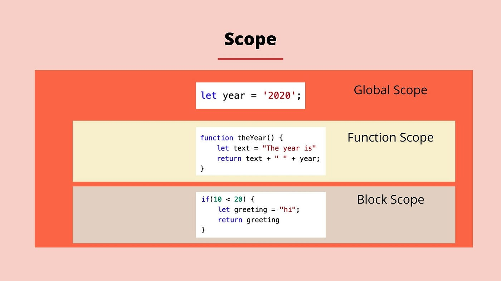
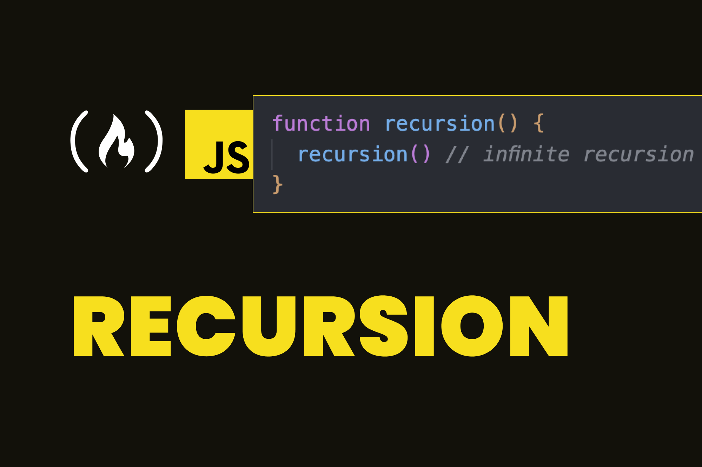
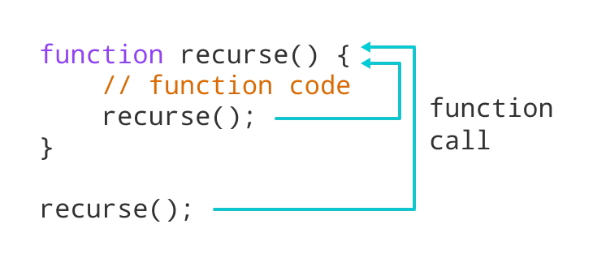
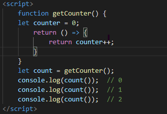

# SCope

Scope дар JavaScript мо область видимоста мегем. Чое ки мо кодхои худро менависем. 
## Scope 4 намуд мешава: 

 - Global Scope
    + Глобалний скоп хамувоера меган берун аз функция ва блок скопо навишта мешаван яне да vscode хдш

 - Function scope
    + Функционалний скоп хаму скопе меган ки дар даруни функция навишта мешава. вариэйбло берун ай у кор намекнан факат дар дарун.

 - Block Scope 
    + Блок скоп мо if ва for мегем.


# Hosting
+ Hosting маънои болорави дора.
Hosting 2 холатда кор мекна функцияи декларацияда ва ай тагйирёбандо var ки undefined меброра.
да let боша hosting технический  кор мекна, практический не. тдз нишон мета. 
+ temporal dead zone

# What is recurse ?

Функсияе хаст ки дар даруни хаму функсия хдша визов мекни, рекурсия ном дорад. Агар онро ман накнем у беохир кор кадан мегира. Функсияи рекурсиви ба мо имконият медихад ки вохиди корро чанд маротиба ичро мекунад.

дар бисори забонхои барномасозии муосир ба мисли JS операторхои for ва while хамчун алтернатива ба функция мебощад. 
Аммо дар баъзе аз забонхо операторхои цикли вучуд надоранд барои хамин ба шумо лозим аст ки рекурсияро барои як пораи кодро чанд маротиба ичро кунед.  


# How to end recurse?


Функсияи рекурсиви бояд условия дошта бошад, ки имконият дихад ки мо онро ман кунем. Дар холати баракс функсия беохир кор мекунадю
Хамон вакте ки условия дуруст мешавад, функсияи ман карда мешавад. Ин холати асоси номида мешавад. Барои пешгири кардани рекурсияи беохир, 
мо метавонем операторхои If ва else -ро истифода барем, ки дар он як кисмаш рекурсияро файрод мекунад дигаращ не.

```javascript
function get(n){
  if(n==1){
    return 1
  }
  return n + get(n - 1)
}
console.log(get(3))

```

# What is closure?
Дар JS closure хар вакте ки функсия дар даруни функсия сохта мешавад
Closure ин файрод кардани як функсия дар даруни функсияи дигар.



# Cколько логических операторов?
3 логичиские оператори || && <br>
3 условные оператори if switchkeys терминалний оператор
#
charAt индекс кабул мекна элемент возваршат мекна минуса кабул намекна
method at ранги chatAt кор мекна минусарам кабул мекна
substring минуса кабул намекна
# What is a Method in java script?
>A method is a block of code which only runs when it is called.
You can pass data, known as parameters, into a method.
Methods are used to perform certain actions, and they are
also known as functions.
# СТРОЧНЫЕ МЕТОДЫ JAVA-СКРИПТОВ


# Строковый метод JavaScript charAt()
>Усули charAt() аломатро дар индекси  малумшуда дар сатр бармегардонад.
Индекси аломати якум 0, дуюм 1, ...
Индекси аломати охирин дарозии сатр аст - 1 .
# Усули сатри JavaScript at ()

>Усули at() арзиши минусаро мегирад ва сатри newString-ро бармегардонад.
Ин усул метоона, ки ададҳои мусбат ва манфӣ дошта бошанд. 
.
# Усули сатри JavaScript concat()
>Theconcat()метод 2 ва зиёда методро кабул мекунад.
Theconcat()метод  стринги навро кабул мекунад.
# Усули сатри JavaScript replace()
Усули replace() сатрро барои арзиш ё ифодаи муқаррарӣ ҷустуҷӯ мекунад.
метод сатри навро бо арзиши нав иваз мекунад.
# Усули сатри JavaScript replaceAll()
>Усули replaceAll() сатри навро бо ҳамаи мувофиқати apatternreplaced by бармегардонад
ҷойгиркунӣ.
# JavaScript String method split()
>The split() method splits a string into an array of substrings. The split() method returns the new
array. The split() method does not change the original string. If (" ") is used as separator, the string is
split between words.
# JavaScript String method substring(start,end)
>JavaScript String method substring(start,end)
Thesubstring()method extracts characters, between two indices (positions), from a string, and
returns the substring.
Thesubstring()method extracts characters from start to end (exclusive).
Thesubstring()method does not change the original string.
If start is greater than end, arguments are swapped: (4, 1) = (1, 4).
Start or end values less than 0, are treated as 0.
# JavaScript String method slice(start, end)
>The method returns a shallow copy of a portion of an array into a new array object
selected from start to end
in that array.
# JavaScript String method toLowerCase()
>ThetoLowerCase()method converts a string to lowercase letters.
ThetoLowerCase()method does not change the original string.

# JavaScript String method toUpperCase()
> ThetoUpperCase()method converts a string to uppercase letters, using current locale.
ThetoUpperCase()method does not change the original string.
# JavaScript String method trim()
>Method
The
removes whitespace from both sides of a string.
method does not change the original string.
# JavaScript String method includes()
>Theincludes()method returnstrueif a string contains a specified string.
Otherwise it returnsfalse.
Theincludes()method is case sensitive.

# JavaScript String method toString()
>ThetoString()method returns a string representing the object.
By defaulttoString()takes no parameters.
# JavaScript String method indexOf()
>The
The
The
method returns the position of the first occurrence of a value in a string.
method returns -1 if the value is not found.
method is case sensitive.
# JavaScript String method repeat()
>Therepeat()method creates a new string by repeating the given string a specified number of
times and returns it.

# JavaScript Number methods Math.round(),ceil(),floor()
>Thefunction rounds down a number to the next smallest integer.
>The
The
function rounds down a number to the next smallest integer.
function returns the number rounded to the nearest integer
>The
function rounds down a number to the next smallest integer.
function returns the number rounded to the nearest integer.
ceil()method rounds a decimal number up to the next largest integer and returns it.
# JavaScript Number methods Math.max() and Math.min()
>The
The method finds the minimum value among the specified values and returns it.
method finds the maximum value among the specified values and returns it.
# JavaScript Number methods Math.pow() and Math.sqrt()
>The
method computes the square root of a specified number and returns it
method computes the power of a number by raising the second argument
sqrt()
pow()
to the power of the first argument.
# JavaScript String method Math.abs() and Math.random()
>The abs()method finds the absolute value of the specified number (without any sign) and returns it.
>The
and1(exclusive).
Math.random() function returns a floating-point, pseudo-random number between0(inclusive)
# JavaScript Number method isNaN()
>The isNaN() function checks if a value isNaN (Not-a-Number)or not
##


# Что такое Array в JS?

Array коллексияхои дорои микдорхои гуногунанд. Дар Js массив руйхати тартиюёфтаи арзишхо мебошад. Хар як арзиш ном монда мешавад ва бо индекс муайян карда мешавад ва массив метавонад микдори арзишхои муаян дошта бошад. Массив як тагйирёбандаи махсус аст ки зиёда аз як арзищ кабул мекунад
# Методы array в JS
 
### forEach(),
### map(), 
### find(),
### filter(),
### reduce(),
### toSorted(),
  ин массивхое хастанд ки бисотар истифода мешаванд.
  ## method push
  барои добавит кадан ай охир
  ## method pop
  барои уд кадан ай охир
  ## method unshift

# Method callback 
## map
## foreach
## find
##

# Destructuring
Значенияи массива отдеьный вариеблда мегира
# Rest
Синтаксиси параметри rest ба имконият мета ки шумораи номуаяни аргументоро хамчун массив мегирад

# What is object in JS?

Дар JavaScript, объект стенд аст
объекти танҳо, бо хосиятҳо ва намуд.
Объектҳои JavaScript метавонанд хосият дошта бошанд,
ки хусусиятхои онхоро муайян мекунанд.
Ҳама чиз дар JavaScript объект аст
Объекти JavaScript як нави маълумот мебошад, ки ба мо имкон мета
маҷмӯаҳои сершумори маълумотро нигох дорем. Объектҳо дар JS ранги калид-кимат муаррифӣ карда мешаванд
Калид номи амвол ё усул аст ва арзиш метавонад бошад
ҳама гуна арзиш, аз ҷумла объекти дигар. Барои сохтани объект дар JavaScript, мо метавонем
ин гуна кавсхоро истифода мебарем {}

# Method in JS ?
Дар JS 3 методхо бисёранд ва мо 3 тои асосиро истифода мебарем
1. Object.entries() - ба мо имконият мета ки мо хам ключ ва хам арзишошона нишон бта да массиви калон
2. Object.keys()  - ба мо имконият мета ки ключои обекта нишон бтем да массив
3. Object.values() - ба мо имконият мета ки value-ро нишон бта да массив 


# Destructuring AND spread in object 
Деструктуризатсия барои сохтани тағирёбандаҳо аз ҷузъҳои массив ё хосиятҳои объект истифода мешавад. Синтаксиси паҳншуда барои кушодани такроршавандаҳо ба монанди массивҳо, объектҳо ва зангҳои функсия истифода мешавад

Синтаксиси spread (...) имкон медиҳад, ки такроршаванда, ба монанди массив ё сатр, дар ҷойҳое, ки сифр ё зиёда аргументҳо (барои зангҳои функсионалӣ) ё элементҳо (барои адабии массив) интизоранд, васеъ карда шаванд. Дар асли объект, синтаксиси паҳншуда хосиятҳои объектро номбар мекунад ва ҷуфтҳои калид-арзишро ба объекти сохташаванда илова мекунад

фаркият
массив дарози дора обект надора
массив ключ надора
property - key ва value


# Dom-(Document Object Model).


### It is presentation of html documents.It allows Java-Script to accept  html  elements  and styles to change them.  

-According to the Document Object Model (DOM for short), every HTML tag is an object. 
Subtags are "children" of the parent element. The text that is inside the tag is also an
object.All these objects are available with JavaScript, we can use them to modify the page.

* JavaScript can modify all HTML elements on a page.
* JavaScript can change all HTML attributes on a page.
* JavaScript can change all CSS styles on a page.
* JavaScript can remove existing HTML elements and attributes.
* JavaScript can add new HTML elements and attributes.
* JavaScript can respond to all existing HTML events on the page.
* JavaScript can fire new HTML events on a page.

## QuerySelector() method

* Returns the first child element that matches a 
specified CSS selector(s) of an element.

## QuerySelectorAll() method

* Method can be used to access all elements 
which match with a specified CSS selector.

## InnerHtml method


* It can remove or change all inner elements .

* document.body.innerHtml = "";

## Styling DOM Elements

* Element.style.color:"red";
* Element.style.fontSize:"10px";
* Element.style.backgroundColor:"green";

## HTML Events

An HTML event can be something the 
browser does, or something a user does.
Here are some examples of HTML events:
* An HTML web page has finished loading.
* An HTML input field was changed.
* An HTML button was clicked.

## BOM

The BOM (Browser Object Model) consists of the objects navigator, history, screen, location and document which are children of window.

## history

Length attributes get the number of times a time access link


  
